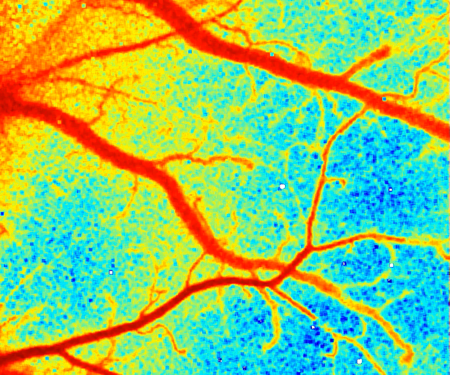

	

			
	

	

		The vision of Dynamic Light is to harness the dynamics of light for health care, science, security, and sustainability, using the principles of dynamic light scattering to generate ‘speckle’ images which have unique characteristics. Speckle imaging enables non-invasive real-time, continuous, and quantitative visualization of blood flow in living tissues. This capability is of great current interest for health care since it enables monitoring of tissue perfusion during surgery.
	

